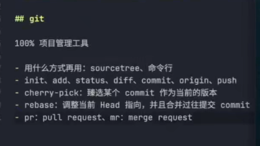

# 大厂 UI 组件库设计封装与实践（React）- 1.需求评审与项目架构设计

# 1

## 架构设计

monorepo 方案，为了在一个 git 仓库中管理多个项目，并且更友好地控制依赖版本

技术要点：pnpm workspace

### 步骤概览

1. 初始化项目，npm init -y
2. monorepo
3. monorepo 配置
4. monorepo 项目的位置

```
  packages:
  - 'apps/*'
  - 'packages/*'
```

3. 设计子包
4. 考虑调试问题，你可以用 dumi 调试，也可以自己搭一个 react 项目调试
5. 规范设计
6. js（eslint 9、prettier）、style（stylelint）
7. 提交规范（commitlint、husky）
8. 拼写检查
9. eslint
   安装:
10. spellcheck
    安装：cspell

11. package.json 中指明依赖
12. 安装
13. 配置
14. 定义脚本
15. 跑脚本测试

# 2

# 3

## git flow

用于流程化代码管理，分支规范和 tag 规范

-   切分支，怎么合分支（merge、rebase）
-   tag，版本号怎么约定

### 分支规范

-   主分支：main、master，用于归档上线代码
-   开发分支：develop，用于开发
-   特性分支：features/xxx，用于特性需求开发
-   发布分支：releases/xxx，用于发布
-   热修复分支：hotfixes/xxx，用于修复线上 bug

### 版本控制

#### 版本号规范

版本号，三位数
x.y.z

x：大版本，重大更新，并且不向后兼容
y：功能新增，向后兼容
z：功能修复，向后兼容

MAJOR.MINOR.PATCH

MAJOR.MINOR.PATCH-beta.0

#### 版本新增流程

1. 方案 1
   当当前项目 git 已完成提交，执行 `npm version x` 来更新版本号
   `npm version major`
   `npm version minor`
   `npm version patch`

2. 方案 2
   安装一个工具 `np`

3. 方案 3
   `semantic release` 很好集成到 CI/CD

## 发布前准备

1. UI 库项目项目
   最终发到 npm 上，但是我们现在是发到公司内网（npm 私服）

-   私服源地址，仓库地址
    -   安装 `nrm`，`pnpm add -g nrm`
    -   添加源：`nrm add miaoma https://packages.aliyun.com/6xxxxxxxe/npm/miaoma/`
    -   切换源：`nrm use miaoma`
    -   登录：`npm login`
        指定 npm 发布包内容：

```json
// package.json
{
    "files": ["es"]
}
```

-   发布：`npm publish`

2. UI 文档项目准备

1. 首先准备构建
   `dumi build`
1. 本地测试，\*\*/docs-dist 加入到 .gitignore 中
1. 创建远程代码仓库，以阿里云效为例
1. 在仓库中执行 git remote add origin https://codeup.aliyun.com/xxxxxx/miaoma-ui.git
1. git push 提交代码
1. 创建阿里云效流水线


merge：（graph中呈现）会保留分支，分支记录时并行的
rebace：无分支（记录）保留，直接合并到对应的分支上面
