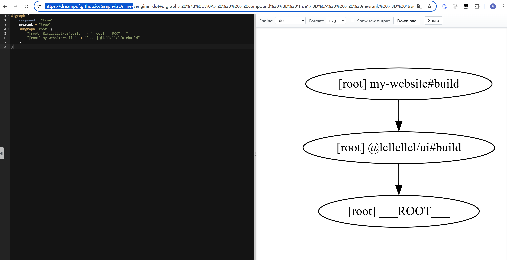
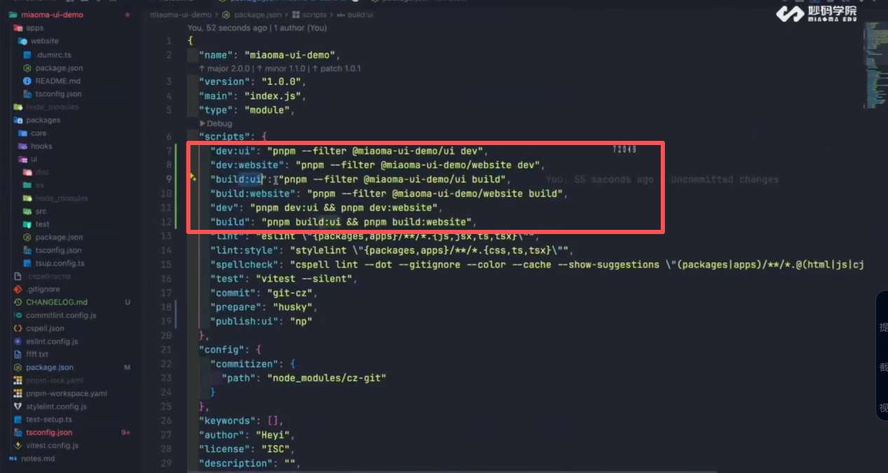

# 1. 常见的package.json的配置

-   npm 官方文档文档地址： https://docs.npmjs.com/cli/v10/configuring-npm/package-json
-   Node.js 官方文档 (模块解析机制)：https://nodejs.org/api/packages.html
-   3 种产物指定入口配置：

```js
{
  "name": "my-ui-library",
  "version": "1.0.0",
  // 1. 类型定义入口 (必须指向 .d.ts)
  "types": "./dist/index.d.ts",

  // 2. CJS 入口 (兼容老旧环境)：https://docs.npmjs.com/cli/v10/configuring-npm/package-json#main
  "main": "./dist/index.cjs",

  // 3. ESM 入口 (兼容不支持 exports 的打包工具)
  "module": "./dist/index.js",

  // 4. IIFE 入口 (给 CDN 用)
  "unpkg": "./dist/index.iife.js",
  "jsdelivr": "./dist/index.iife.js",

  // 5. 现代入口配置 (最高优先级:一般不配置
  "exports": {
    ".": {
      "types": "./dist/index.d.ts",  // TS 类型
      "import": "./dist/index.js",   // 遇到 import 语句，用 ESM
      "require": "./dist/index.cjs"  // 遇到 require 语句，用 CJS
    },
    // 如果你允许用户引入 CSS
    "./style.css": "./dist/style.css"
  },

  // 指定发布到 npm 的文件白名单
  "files": [
    "dist"
  ]
}

```

# 使用@lcllcllcl/ui

1. 方法1：

-   使用workspace创建软连接，连接@miaoma/ui：可以在node_modules中查看

```js
import { Button } from '@lcllcllcl/ui'
```

默认会去node_modules/@lcllcllcl/ui/package.json中寻找入口文件（main、module、type），然后根据入口文件设置的路径去寻找资源

> 场景一：用户在 Vite/Next.js 项目中开发 (ESM)
> 代码： import { Button } from 'my-ui-library';
> 流程：
> Vite 读取 package.json。
> 发现 exports 字段。
> 匹配 import 条件。
> 结果： 加载 ./dist/index.js (ESM)。
> 收益： 成功 Tree-shaking，只打包了 Button 的代码。

-   打包@miaoma/ui，产生需要的静态资源

2. 进阶解决方法2：适用于开发环境：

-   使用workspace创建软连接，连接@miaoma/ui：可以在node_modules中查看
-   将包名直接映射到@miaoma/ui源码入口： [vite.config.ts](apps/use-ui/vite.config.ts)

```js
'@lcllcllcl/ui': path.resolve(__dirname, '../../packages/ui/src/index.ts')
```

> 这样做的收益：
>
> -   无需构建： 开发时直接消费 TS 源码。
> -   实时调试： console.log 或断点直接打在源码里，而不是压缩后的代码里。

-   打包工具搞定，下面配置TS 编译器，TS 编译器默认不会像 Vite 那样去读 Alias，所以会找不到路劲：配置paths、与include：[tsconfig.app.json](tsconfig.app.json)

# tsup rollup、vite常见的打包配置(后面了解 )

> 遇到了在查看文档问ai

-   tsup: https://tsup.egoist.dev/#multiple-entrypoints
    [tsconfig.json](packages/ui/tsconfig.json)

# 状态管理

-   笔记：https://my.feishu.cn/docx/CEQcd7dgyoMwhjxD9Y6cC3RDn9a
-   Mantine UI 内部自实现的集中状态管理：（学习）https://github.com/mantinedev/mantine/blob/master/packages/%40mantine/store/src/store.ts
-   官网useSyncExternalStore：https://zh-hans.react.dev/reference/react/useSyncExternalStore

    -   代码：[code](apps/use-ui/src/01.learn-useSyncExternalStore)

# 初步认识vitest: [text](packages/ui/vitest.md)

# Turbo

1. 官网：https://turbo.nodejs.cn/docs/crafting-your-repository/managing-dependencies
2. 任务配置：[text](turbo.json)

3. 理解dependsOn：是 Turborepo 用来 控制任务执行顺序 的配置项；在运行某个任务之前，需要先运行哪些其他任务

-   依赖自身包内的任务:用来控制 同一个包里脚本的顺序。
    > 例如：想要在同一个包里：先执行 build，再执行 test

```json
// 当 Turborepo 运行 test 时，会先执行这个包里的 build 脚本，再执行 test
{
    "tasks": {
        "test": {
            "dependsOn": ["build"]
        }
    }
}
```

-   依赖其他包的任务 — 使用 ^ 前缀。

> 例如：通常在 monorepo 中，我们有：apps/web → 依赖 packages/ui
> 你想让：先执行 packages/ui 的 build;再执行 apps/web 的 build

```json
// ^build 告诉 Turborepo：“先运行所有依赖包里的 build 任务，再运行当前包的 build”: packages/ui#build → apps/web#build
{
    "tasks": {
        "build": {
            "dependsOn": ["^build"]
        }
    }
}
```

-   依赖某个具体包里的某个任务: 有时不是全部依赖，而是特定某个包的某个任务。
    > 例子:你有一个 utils 包，它有 build。你希望所有其它包运行 lint 之前：先运行 utils 的 build

```json
// 这里的 utils#build 就是 “utils 包的 build 任务必须先执行完”，才能运行后面的 lint
{
    "tasks": {
        "lint": {
            "dependsOn": ["utils#build"]
        }
    }
}
```

4. 配置启动命令

-   不使用turbo:

```json
"myWebsite:build": "pnpm --filter my-website build",
"ui:build": "pnpm --filter @lcllcllcl/ui build",
"my:build:pnpm": "pnpm ui:build &&  pnpm myWebsite:build",
```

-   使用turbo:
    [turbo.json配置：](turbo.json)

```json
// build的时候只会执行my-website的build, 因为有 ^build，它会自动把 @lcllcllcl/ui（以及更多上游依赖）一起 build。
 "my:build": "turbo run build  --filter=my-website",
//  预览地址：https://dreampuf.github.io/GraphvizOnline/
 "my:build:graph": "turbo run build  --filter=my-website --graph"
```

    把运行的graph代码复制到这个网站上：



# nrm

    作用类似nvm：https://github.com/Pana/nrm

```js
npm install -g nrm
nrm ls
nrm use
nrm add

```

# npm 发包：

    组件库发布：npm仓库、阿里云效平台的制平台、Npm 私服搭建：https://verdaccio.org/zh-cn/

## npm注意：

1. npm双token验证的限制np用不了，可以不让np发包。让np完成打包、测试、打版本号、打tag就行

2. semantic release 后面学ci/cd在试试。

## 1. 发包配置

-   publishConfig 配置发包的信息：[publishConfig](packages/ui/package.json)
-   配置npm 登录、资源下载的registry 配置：[npmrc](packages/ui/.npmrc)
-   配置发哪些包files： [files](packages/ui/package.json)

## 2. np的配置：

```js
"scripts": {
        "release": "np --otp",
        "release:preview": "np --preview",
        "release:noTests": "np --no-tests"
    },
    "np": {
        "packageManager": "pnpm",
        "cleanup": false,
        "tests": true,
        "yarn": false,
    },
```

## 3. 自动生成日志：

1. np 来管理版本发布，我建议使用 conventional-changelog-cli

-   安装：pnpm add -D conventional-changelog-cli
    > -   conventional-changelog-cli - 轻量级 CLI，只生成 CHANGELOG
    > -   @changesets/cli - 适合 monorepo，交互式生成 changelog

2. 添加 npm scripts

-   pnpm changelog - 增量更新 changelog
-   pnpm changelog:init - 生成完整 changelog
-   pnpm version - 与 git 集成的版本钩子

3. 创建配置文件

-   conventional-changelog-cli(不生效)
-   自定义 changelog 生成规则，添加了 emoji：[changelogrc](packages/ui/.changelogrc.js)

4. 集成 np

-   版本自动化管理：git的tag与包的版本
-   配置 np 钩子，在发布时自动生成 changelog:

```js
"np": {
        "packageManager": "pnpm",
        "cleanup": false,
        "tests": true,
        "yarn": false,
        "hooks": {
            "version": "pnpm version && git add CHANGELOG.md"
        }
    },
```

5. 更新npm发包文件

```js
 "files": [
        "esm-dist",
        "iife-dist",
        "cjs-dist",
        "CHANGELOG.md"
    ],
```

# 使用阿里云效平台的制平台发包

-   https://packages.aliyun.com/npm/npm-registry/guide

<!-- -----------asdasdasd------ -->

vscode 的插件怎么提示安装库、有哪些版本

<!-- ------需要实现的任务-------- -->

发布：



组件文档发布
npm install -g nrm
